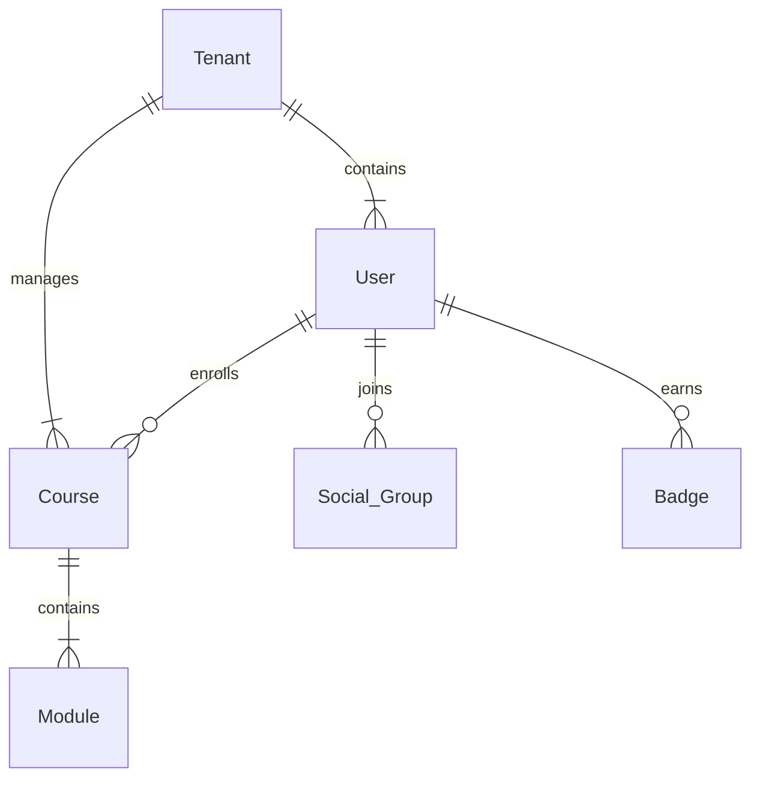

# 🎓 Bodhi Learning Platform

[](https://opensource.org/licenses/MIT)
[](http://makeapullrequest.com)
[](https://www.docker.com/)
[](./docs)


A comprehensive multi-tenant learning platform that combines educational content delivery with social learning features. Bodhi aims to create an engaging learning environment where education meets community.

## 📊 Statistics


## 🔗 Quick Links
[Documentation](https://docs.bodhilearn.com) • 
[API Reference](https://api.bodhilearn.com) • 
[Community](https://discord.gg/bodhi-learning) • 
[Support](mailto:support@bodhi-learn.com)

## 🎮 Demo

[Live Demo](https://demo.bodhilearn.com) | [Video Tutorial](https://youtube.com/bodhilearning)

<p align="center">
  
</p>

## ✨ Features Showcase

| Feature | Screenshot | Description |
|---------|------------|-------------|
| Course Dashboard |  | Interactive learning dashboard with progress tracking |
| Social Learning |  | Community features and peer learning tools |
| Analytics |  | Comprehensive learning analytics and insights |
| Multi-tenant System |  | Customizable tenant spaces with branding |

## 🌟 Key Features

### 🎯 Core Learning Features
- **Course Management**
  - Structured course creation and delivery
  - Interactive content modules
  - Assessment and quiz systems
  - Real-time progress tracking

- **Adaptive Learning**
  - AI-powered personalized learning paths
  - Intelligent content recommendations
  - Learning pace optimization
  - Customized assessment difficulty

### 🤝 Social Learning
- **Community Features**
  - Discussion forums
  - Study groups
  - Peer-to-peer learning
  - Social posts and shorts
  - Interactive stories

- **Engagement Tools**
  - Gamification system
  - Badges and achievements
  - Leaderboards
  - Challenges and events

## 🏗 System Architecture

<p align="center">
  
</p>

### Database Schema

[View complete database schema](./docs/schema.md)

## 💻 Tech Stack

<p align="center">
  
  
  
  
  
  
</p>

- **Backend**: Node.js, Express
- **Frontend**: React, Next.js
- **Database**: PostgreSQL
- **Cache**: Redis
- **Search**: Elasticsearch
- **File Storage**: AWS S3
- **CDN**: Cloudfront
- **Analytics**: Clickhouse

## 💪 Supported Environments

| Environment | Support Status |
|-------------|---------------|
| Node.js 16+ | ✅ Full |
| Docker | ✅ Full |
| Kubernetes | ✅ Full |
| AWS | ✅ Full |
| GCP | 🚧 In Progress |
| Azure | 🚧 In Progress |

## 🛣 Roadmap

- [x] Multi-tenant system
- [x] Course management
- [x] Social features
- [x] AI-powered learning paths
- [ ] Mobile app (Q1 2025)
- [ ] AR/VR learning experiences (Q2 2025)
- [ ] Blockchain certificates (Q3 2025)
- [ ] Live classroom features (Q4 2025)

## 🚀 Getting Started

### Prerequisites
- Node.js >= 16
- PostgreSQL >= 13
- Redis >= 6
- Docker (optional)

### Installation

1. Clone the repository
```bash
git clone https://github.com/bodheeshvc/bodhi-learning-platform.git
cd bodhi-learning-platform
```

2. Install dependencies
```bash
npm install
```

3. Configure environment variables
```bash
cp .env.example .env
# Edit .env with your configuration
```

4. Run database migrations
```bash
npm run migrate
```

5. Start the development server
```bash
npm run dev
```

### Docker Deployment

```bash
docker-compose up -d
```

## 📚 Documentation

- [API Documentation](./docs/api.md)
- [Architecture Overview](./docs/architecture.md)
- [Deployment Guide](./docs/deployment.md)
- [Contributing Guidelines](./CONTRIBUTING.md)

## 🧪 Testing

Run the test suite:
```bash
npm test
```

Run with coverage:
```bash
npm run test:coverage
```

## 📦 API Endpoints

### Authentication
```
POST /api/v1/auth/login
POST /api/v1/auth/register
POST /api/v1/auth/refresh-token
```

### Courses
```
GET /api/v1/courses
POST /api/v1/courses
GET /api/v1/courses/:id
PUT /api/v1/courses/:id
DELETE /api/v1/courses/:id
```

### Social Features
```
GET /api/v1/posts
POST /api/v1/posts
GET /api/v1/groups
POST /api/v1/groups
```

[View complete API documentation](./docs/api.md)

## 🤝 Contributing

We welcome contributions! Please see our [Contributing Guidelines](CONTRIBUTING.md) for details.

<p align="center">
  
</p>

1. Fork the repository
2. Create your feature branch
3. Commit your changes
4. Push to the branch
5. Open a Pull Request

## 📄 License

This project is licensed under the MIT License - see the [LICENSE](LICENSE) file for details.

## 🙏 Acknowledgments

- Thanks to all contributors who have helped shape Bodhi
- Special thanks to our early adopters and testers
- Built with support from the open-source community

## 📞 Contact & Support

- Website: [bodhilearn.com](https://bodhilearn.com), [bodhilearning.in](https://bodhilearning.in/)
- Email: support@bodhi-learn.com, bodheeshvc.developer@gmail.com
- LinkedIn: [@BodhiLearning](https://www.linkedin.com/company/bodhi-learning-app/), [@Bodheesh vc](https://www.linkedin.com/in/bodheeshvc/)
- Twitter: [@BodhiLearning](https://twitter.com/BodhiLearning)
- Discord: [Join our community](https://discord.gg/bodhi-learning)

<p align="center">
  
</p>

---

<p align="center">Built with ❤️ by the Bodhi Team</p>
