# Bodhi Learn - Complete System Entity Relationship Diagram

## Database Schema and Relationships

```mermaid
erDiagram
    %% Identity Management Service
    Tenant ||--o{ Organization : has
    Tenant {
        string id PK
        string name
        string domain
        string status
        json settings
        json branding
        json configuration
        datetime created_at
        datetime updated_at
        string created_by FK
        string updated_by FK
    }
    
    Organization ||--o{ Department : contains
    Organization ||--o{ Branch : has
    Organization {
        string id PK
        string tenant_id FK
        string name
        string type
        string status
        string address
        string contact_email
        string contact_phone
        json metadata
        json settings
        json configuration
        datetime created_at
        datetime updated_at
        string created_by FK
        string updated_by FK
    }

    Branch ||--o{ Department : houses
    Branch {
        string id PK
        string org_id FK
        string name
        string code
        string address
        string contact_info
        string status
        json metadata
        datetime created_at
        datetime updated_at
    }

    Department ||--o{ User : has
    Department {
        string id PK
        string org_id FK
        string branch_id FK
        string name
        string code
        string description
        string parent_id FK
        string head_user_id FK
        string status
        json metadata
        datetime created_at
        datetime updated_at
    }

    User ||--o{ UserRole : has
    User ||--o{ UserProfile : has_profile
    User ||--o{ UserSession : has_sessions
    User {
        string id PK
        string org_id FK
        string dept_id FK
        string email
        string password_hash
        string first_name
        string last_name
        string username
        string status
        string phone
        boolean email_verified
        boolean phone_verified
        json preferences
        json settings
        datetime last_login
        datetime password_changed_at
        datetime created_at
        datetime updated_at
        string created_by FK
        string updated_by FK
    }

    UserProfile {
        string id PK
        string user_id FK
        string avatar_url
        string bio
        json social_links
        json additional_info
        json preferences
        datetime created_at
        datetime updated_at
    }

    UserSession {
        string id PK
        string user_id FK
        string token
        string device_info
        string ip_address
        datetime expires_at
        datetime last_active_at
        datetime created_at
    }

    Role ||--o{ UserRole : assigned_to
    Role ||--o{ RolePermission : has
    Role {
        string id PK
        string org_id FK
        string name
        string code
        string description
        string scope
        json metadata
        datetime created_at
        datetime updated_at
    }

    Permission ||--o{ RolePermission : granted_to
    Permission {
        string id PK
        string name
        string code
        string description
        string resource
        string action
        string scope
        datetime created_at
        datetime updated_at
    }

    RolePermission {
        string id PK
        string role_id FK
        string permission_id FK
        json conditions
        datetime created_at
        datetime updated_at
    }

    UserRole {
        string id PK
        string user_id FK
        string role_id FK
        string org_id FK
        datetime assigned_at
        datetime expires_at
        string assigned_by FK
        datetime created_at
        datetime updated_at
    }

    %% Learning Management Service
    Course ||--o{ Module : contains
    Course ||--o{ Enrollment : has_students
    Course ||--o{ CourseInstructor : has_instructors
    Course {
        string id PK
        string org_id FK
        string dept_id FK
        string code
        string title
        string description
        string category
        string difficulty_level
        string status
        integer duration_hours
        json prerequisites
        json learning_objectives
        json metadata
        json settings
        datetime published_at
        datetime archived_at
        datetime created_at
        datetime updated_at
        string created_by FK
        string updated_by FK
    }

    CourseInstructor {
        string id PK
        string course_id FK
        string user_id FK
        string role
        datetime assigned_at
        datetime removed_at
        datetime created_at
        datetime updated_at
    }

    Module ||--o{ Unit : contains
    Module ||--o{ ModulePrerequisite : has_prerequisites
    Module {
        string id PK
        string course_id FK
        string title
        string description
        integer sequence_no
        integer duration_mins
        string status
        json learning_objectives
        json metadata
        datetime published_at
        datetime created_at
        datetime updated_at
        string created_by FK
    }

    ModulePrerequisite {
        string id PK
        string module_id FK
        string prerequisite_module_id FK
        string requirement_type
        datetime created_at
        datetime updated_at
    }

    Unit ||--o{ Content : has
    Unit ||--o{ Assessment : has_assessments
    Unit {
        string id PK
        string module_id FK
        string title
        string description
        string type
        integer sequence_no
        integer duration_mins
        json settings
        string status
        datetime published_at
        datetime created_at
        datetime updated_at
        string created_by FK
    }

    Content ||--o{ Resource : uses
    Content ||--o{ ContentProgress : tracks_progress
    Content {
        string id PK
        string unit_id FK
        string type
        string title
        json content_data
        string status
        integer estimated_duration
        json metadata
        datetime published_at
        datetime created_at
        datetime updated_at
        string created_by FK
    }

    Resource {
        string id PK
        string content_id FK
        string type
        string title
        string url
        string mime_type
        integer size_bytes
        json metadata
        datetime created_at
        datetime updated_at
    }

    Assessment ||--o{ Question : contains
    Assessment ||--o{ AssessmentAttempt : tracks_attempts
    Assessment {
        string id PK
        string unit_id FK
        string title
        string description
        string type
        integer passing_score
        integer max_score
        integer duration_mins
        integer max_attempts
        json settings
        string status
        datetime published_at
        datetime created_at
        datetime updated_at
        string created_by FK
    }

    Question ||--o{ Option : has_options
    Question ||--o{ QuestionResponse : has_responses
    Question {
        string id PK
        string assessment_id FK
        string type
        string question_text
        json metadata
        integer points
        json correct_answer
        json explanation
        datetime created_at
        datetime updated_at
    }

    Option {
        string id PK
        string question_id FK
        string text
        boolean is_correct
        integer sequence_no
        json metadata
        datetime created_at
        datetime updated_at
    }

    AssessmentAttempt ||--o{ QuestionResponse : contains
    AssessmentAttempt {
        string id PK
        string assessment_id FK
        string user_id FK
        string enrollment_id FK
        integer attempt_number
        integer score
        string status
        datetime start_time
        datetime end_time
        datetime submitted_at
        datetime created_at
        datetime updated_at
    }

    QuestionResponse {
        string id PK
        string attempt_id FK
        string question_id FK
        json response_data
        boolean is_correct
        integer points_earned
        json feedback
        datetime created_at
        datetime updated_at
    }

    Enrollment ||--o{ ContentProgress : tracks
    Enrollment ||--o{ AssessmentAttempt : includes
    Enrollment {
        string id PK
        string user_id FK
        string course_id FK
        string status
        float progress
        datetime enrolled_at
        datetime start_date
        datetime completion_date
        json completion_criteria
        datetime created_at
        datetime updated_at
    }

    ContentProgress {
        string id PK
        string enrollment_id FK
        string content_id FK
        string status
        float progress
        integer time_spent_mins
        datetime last_accessed
        datetime completed_at
        datetime created_at
        datetime updated_at
    }

    %% Discussion System
    Discussion ||--o{ Comment : has
    Discussion {
        string id PK
        string course_id FK
        string unit_id FK
        string user_id FK
        string title
        string content
        string type
        string status
        integer view_count
        datetime created_at
        datetime updated_at
    }

    Comment ||--o{ CommentReaction : receives
    Comment {
        string id PK
        string discussion_id FK
        string user_id FK
        string content
        string parent_id FK
        integer likes_count
        datetime created_at
        datetime updated_at
    }

    CommentReaction {
        string id PK
        string comment_id FK
        string user_id FK
        string reaction_type
        datetime created_at
    }

    %% Certificate System
    Certificate ||--o{ CertificateTemplate : uses
    Certificate {
        string id PK
        string user_id FK
        string course_id FK
        string template_id FK
        string certificate_number
        string certificate_url
        json metadata
        datetime issue_date
        datetime expiry_date
        datetime created_at
        datetime updated_at
    }

    CertificateTemplate {
        string id PK
        string org_id FK
        string name
        string description
        json template_data
        string status
        datetime created_at
        datetime updated_at
    }

    %% Analytics System
    AnalyticsEvent {
        string id PK
        string user_id FK
        string event_type
        string entity_type
        string entity_id
        json event_data
        string session_id
        datetime created_at
    }

    UserActivity {
        string id PK
        string user_id FK
        string activity_type
        string entity_type
        string entity_id
        json activity_data
        datetime created_at
    }

    %% Notification System
    Notification ||--o{ NotificationRecipient : sent_to
    Notification {
        string id PK
        string type
        string title
        string content
        json metadata
        string status
        datetime scheduled_at
        datetime sent_at
        datetime created_at
        datetime updated_at
    }

    NotificationRecipient {
        string id PK
        string notification_id FK
        string user_id FK
        boolean is_read
        datetime read_at
        datetime created_at
    }

    %% Settings and Preferences
    SystemSettings {
        string id PK
        string category
        string key
        json value
        string description
        datetime created_at
        datetime updated_at
    }

    UserPreference {
        string id PK
        string user_id FK
        string category
        string key
        json value
        datetime created_at
        datetime updated_at
    }
```



## Key Features and Workflows

1. **Identity Management**
   - Multi-tenant system with organization hierarchy
   - Role-based access control with granular permissions
   - User session management
   - Profile and preference management

2. **Course Management**
   - Hierarchical course structure
   - Module prerequisites and sequencing
   - Multiple content types
   - Resource management

3. **Learning Progress**
   - Enrollment tracking
   - Content progress monitoring
   - Assessment attempts and scoring
   - Certificate generation

4. **Engagement**
   - Discussion forums
   - Comment system
   - Notification management
   - Activity tracking

5. **Analytics**
   - User activity tracking
   - Learning analytics
   - Progress reporting
   - Performance metrics

## Key Relationships

1. **Organizational Structure**
   ```
   Tenant → Organization → Branch → Department → User
   ```

2. **Course Structure**
   ```
   Course → Module → Unit → (Content/Assessment)
   ```

3. **Learning Journey**
   ```
   Enrollment → ContentProgress → Assessment → Certificate
   ```

4. **User Management**
   ```
   User → (UserProfile, UserRole, UserPreference)
   ```

5. **Access Control**
   ```
   Role → RolePermission → Permission
   ```

This ER diagram represents the complete data structure of the Bodhi Learn platform, showing all entities, their attributes, and relationships across different service domains.
